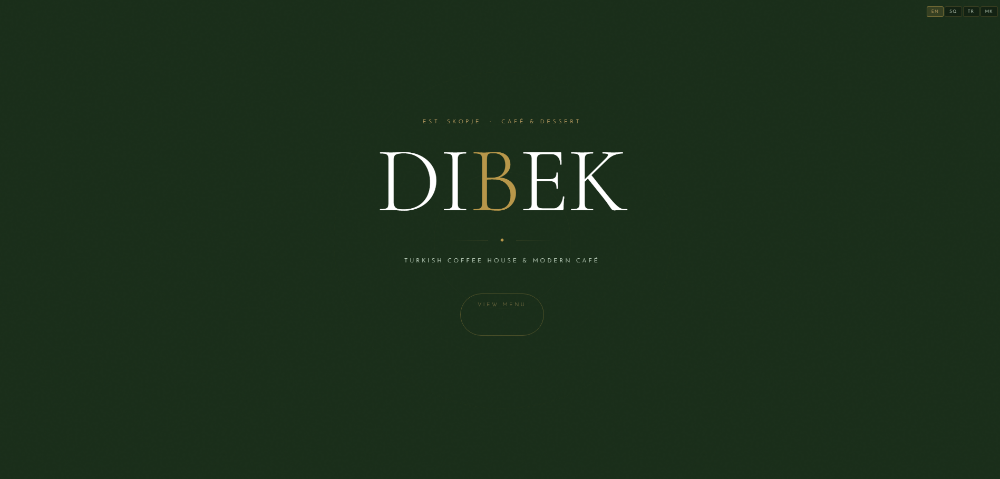

# DIBEK Café Digital Menu

A mobile-first digital menu for DIBEK, a Turkish coffee house and café in Skopje, North Macedonia.

**Live site:** [dibekcoffe.github.io/Dibek-](https://dibekcoffe.github.io/Dibek-/)
**Status:** Live

## What it does

Customers can browse the café's full menu on their phone in English, Albanian, Turkish or Macedonian. Because the menu is a website, the café can change a price or add a new drink by editing one file, without reprinting anything.

## What I built

- A language switcher for English, Albanian, Turkish and Macedonian
- Five menu sections (Coffee & Tea, Drinks, Smoothies, Juices, Desserts) with prices in denars
- A bottom navigation bar that jumps to each section, sized for thumbs
- A dark green and gold design that matches the café's brand
- Settings that let the menu open full-screen when it's saved to a phone's home screen

## Built with

HTML, CSS and JavaScript. Hosted on GitHub Pages.

## Run it on your computer

Download this repository and open `index.html` in any browser.

---

Built by [Fisnik Zenuli](https://github.com/fisnikzenuli)
